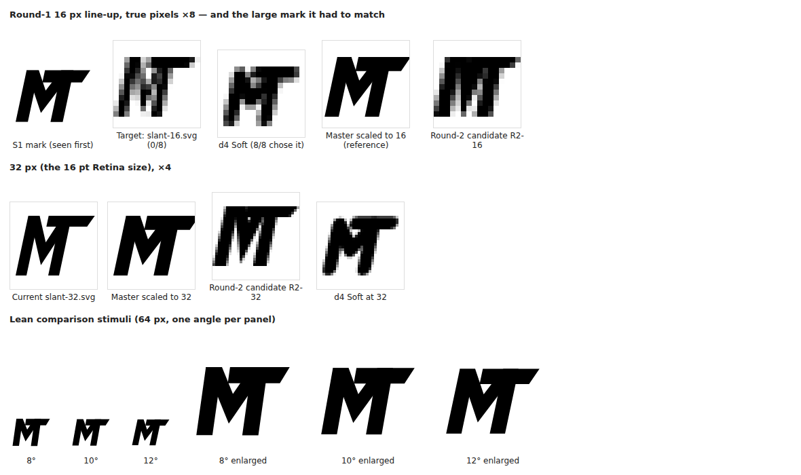

# Diagnosis of the round-1 16 px failure

Evidence: `diagnosis.png` (visual) and `measurements.txt` (numbers). Rebuild both with `node build.mjs && node measure.mjs`.

## 1. What the line-up actually asked

Participants saw the 64 px mark (S1) first, then five 16 px glyphs, and had to pick "the same mark".
That is a visual-match task: people pick whichever small glyph looks most like the big one. It does
not measure whether the small glyph is a faithful drawing of the mark.

The four decoys came from rejected rounds. One of them, **d4 Soft**
(`design/brand/gen3/marks.mjs`), uses exactly Slant's construction: an M whose right leg is the T's
stem, with a full-width crossbar across the top. The only differences are round stroke ends and no
lean. The test harness then gave every decoy Slant's 12° lean and fitted it to the same 15 × 11 px
glyph box. At 16 px, round ends and sharp ends render as the same grey pixels. So Soft, as shown, was
effectively Slant scaled down with a uniform heavy stroke.

## 2. What the microglyph did differently

`slant-16.svg` was drawn for letter legibility (D-014). It uses thinner diagonals (1.2 px against 2 px
stems), a V opened deep enough to show a white counter, and a half-pixel gap between the V and the T
stem. The master does the opposite: diagonals at 15/17 of the stem weight, a shallow V, and the M and
T fused into one block.

| At 16 px (glyph 11 px tall) | Master | Soft (d4) | Microglyph |
|---|---|---|---|
| Stem : diagonal | 1 : 0.88 | uniform, heavy | 1 : 0.6 |
| V depth (of glyph height) | 0.61 | — | 0.75 |
| M and T | fused block | fused block | two letters with a gap |
| Ink relative to master | 100% | 94% | 83% |

**Pixel match to the master** at the same glyph height is the correlation with the master rendered at
16 px. It takes the best of 153 sub-pixel alignments, so position can't bias it. Higher means more
alike:

| Glyph | Match | Match at viewing blur |
|---|---|---|
| **d4 Soft (8/8 chose it)** | **0.904** | **0.959** |
| Round-1 target, `slant-16.svg` (0/8) | 0.866 | 0.942 |
| d3 Caret | 0.792 | 0.883 |
| d2 Gate | 0.729 | 0.849 |
| d1 Crown | 0.635 | 0.765 |
| *Round-2 candidate R2-16* | *0.943* | *0.976* |

The ranking puts Soft first, which is exactly what all eight participants picked. **Conclusion:** the
microglyph traded the mark's mass and fused silhouette for small-size letter legibility, and moved far
enough that a sibling construction resembled the master more. This is a real identity-drift defect,
not an unlucky draw. The round-1 FAIL stands.

## 3. The 32 px optical master has the same drift

`slant-32.svg` (18–40 px, and the 16 pt size on Retina) was lightened by the same rules: 4 px stems,
3.4 px diagonals, a deep V. It is untested by people. Measured the same way, it is further from the
master than Soft is:

| At 32 px | Ink vs master | Match | Match at viewing blur |
|---|---|---|---|
| d4 Soft | 86% | 0.859 | 0.926 |
| Current `slant-32.svg` | 77% | 0.786 | 0.864 |
| *Round-2 candidate R2-32* | *97%* | *0.937* | *0.969* |

The 16 px icon microglyph (`slant-icon-16-inner.svg`) was drawn by the same approach. It should follow
whatever rule round 2 settles, and it is validated at the Mac icon gate.

## 4. Proposed correction strategy (bounded)

Keep D-014's pixel discipline (horizontals on whole pixel rows, whole-pixel stems, lean about the
baseline) but **stop lightening**. Derive every small drawing mechanically from the master
(`candidates.mjs`, `derive()`):

1. Scale the master construction to the target glyph height (11 px in the 16 px box, 22 px in the 32 px box).
2. Snap the top, crossbar and baseline to whole pixel rows, and round stems to whole pixels (3 px and 5 px).
3. Keep diagonals at the master's 15:17 ratio to the stems, and keep the V vertex at the master's depth (44/72).
4. Keep the M and T fused (no gap). Centre the glyph in its box; at master proportions it is about
   1.44× as wide as it is tall, so it fills the box width.

This is a rule, not a redesign. The master, the construction, the wedge cut and the lean are
untouched, and the result can be regenerated at any lean tranche A keeps. The trade-off is deliberate:
at 16 px the V counter mostly fills in, so the small glyph is recognised by silhouette rather than
spelled. That matches D-019's 16 px criterion (recognition, not reading).

## 5. The automotive trigger

The formal count is 6 of 8, using the round-1 keyword list, which includes "sport" and "speed". Read
narrowly as cars or motorsport only, it is 4 of 8 (P4, P6, P7, P8). That is still at least 3, so the
HOLD stands under either reading and D-021 applies. Round 2 reports both counts, but only the round-1
list decides the gate.

## 6. A provenance question to settle before round 2

The raw transcripts in `../read-test/raw/` read like responses from AI assistants given image files,
not like notes from a facilitated session. Several open with "Here are the responses based on the
visual stimuli provided", use Markdown headings, and refer to files such as "S1.png". The line-up
choices are not in the transcripts; they were supplied separately. If the reviewers were AI models
rather than people shown the timed slides, round 1 was not the human test D-019 and D-023 describe:
it had no 5-second first exposure and the 16 px glyphs were not seen at true size. Model image-matching
would also explain why the choices follow the pixel-match ranking so exactly. This note doesn't change
the recorded result, but round 2 must use people (see `PROTOCOL.md`).
